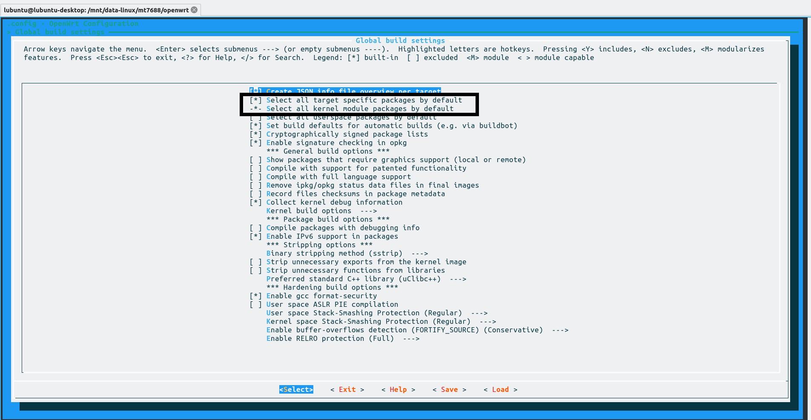

[TOC]


# 写在前面

## 说明

为了方便调试MT7688开发板，有时需要将自己喜欢的名字加入openwrt的选择列表，这样编译后在openwrt的管理界面显示的就是自己定义的名字了。本文参照Openwrt中某些开发版的配置文件写了自己的配置，以下均为笔记或个人理解。

### 硬件概况

- MT7688
- 128M RAM
- 16M SPI Flash
- 串口0用作调试
- 启用以太网口0（WAN）
- 启用WIFI

**注意：硬件情况不同，设备树dts文件（用于配置linux内核）的写法也不同。若不是MT7688芯片修改的文件也就略有不同。**


## openwrt下载

https://github.com/openwrt/openwrt.git

**注意：本文仅适用于19.07版本，下载时需要下载19.07分支，其它分支操作可能略有不同**

## openwrt编译的一般过程

1. 下载源码
2. 进入*源码目录*
3. 执行./scripts/feeds update -a更新feed
4. 执行./scripts/feeds update -a安装feed
5. 执行make menuconfig进行配置
   - 选择编译的目标设备
   - 选择编译的packages
   - 配置其它编译选项
6. 执行make编译
7. 在 *源码目录/bin* 下找到需要的文件给设备升级（需要提前刷好u-boot或安装旧版本openwrt强制升级）

可能需要的问题：

-  网络不通，XX下载失败。openwrt本身需要在编译过程中下载各种源代码，如果网络不好将导致编译极其缓慢，严重时会编译失败。若因为下载失败导致编译失败可手动到各大镜像站下载对应的文件放到*源码目录/dl*中再执行make编译。
- 缺少某某软件，提示 XX not found。根据提示安装上对应软件即可。对于ubuntu及其衍生版，至少应当安装build-essential软件包

# 自定义型号

自定义型号主要包含以下3个方面：

- 添加设备信息到openwrt。
- 添加设备树dts配置硬件。
- 配置rootfs（即修改openwrt的base-files目录），一般只修改etc目录中的配置文件。

**注意：以下添加的设备型号名称为HYH-MT7688，厂商名为HYH**

## 添加设备信息

- 修改文件路径： 源码目录/target/linux/ramips/image/mt76x8.mk
- 添加设备信息，模板如下（不代表所有选项，具体参考其它设备的配置信息）：

`define Device/设备型号名称`
  `DTS := DTS文件名（可自定义，但一般与设备型号一致）` 
  `IMAGES :=sysupgrade.bin`
  `IMAGE_SIZE := 固件大小`
  `DEVICE_TITLE := 设备型号信息（可自定义，但一般与设备型号一致）`
  `DEVICE_PACKAGES := 设备需要的packages`
`endef`
`TARGET_DEVICES += 设备型号名称`

- 修改示例：


修改后就可以在make menuconfig中选择自己添加的设备，但为了编译正确，还需要添加dts文件，修改rootfs。


## 添加设备树dts

- 目录：源码目录/target/linux/ramips/dts/，文件名：DTS文件名.dts

-  对于MT7688,dts设备树包含的文件为mt7628an.dtsi

- 具体写法参考其它设备的设备树写法。示例：

  ```c
  /dts-v1/;
  
  #include "mt7628an.dtsi"
  
  #include <dt-bindings/gpio/gpio.h>
  #include <dt-bindings/input/input.h>
  
  / {
  	compatible = "HYH,HYH-MT7688", "mediatek,mt7628an-soc";
  
  	model = "HYH-MT7688";
  
  	chosen {
  		bootargs = "console=ttyS0,115200";
  	};
  
  	memory@0 {
  		device_type = "memory";
  		reg = <0x0 0x8000000>;
  	};
  
  
  	wgpio: gpio-wifi {
  		compatible = "mediatek,gpio-wifi";
  		#address-cells = <1>;
  		#size-cells = <0>;
  		gpio-controller;
  		#gpio-cells = <2>;
  	};
  };
  
  &pinctrl {
  	state_default: pinctrl0 {
  		gpio {
  			ralink,group = "gpio";
  			ralink,function = "gpio";
  		};
  
  		perst {
  			ralink,group = "perst";
  			ralink,function = "gpio";
  		};
  
  		refclk {
  			ralink,group = "refclk";
  			ralink,function = "gpio";
  		};
  
  		i2s {
  			ralink,group = "i2s";
  			ralink,function = "gpio";
  		};
  
  		spis {
  			ralink,group = "spis";
  			ralink,function = "gpio";
  		};
  
  		wled_kn {
  			ralink,group = "wled_kn";
  			ralink,function = "gpio";
  		};
  
  		wled_an {
  			ralink,group = "wled_an";
  			ralink,function = "wled_an";
  		};
  
  		wdt {
  			ralink,group = "wdt";
  			ralink,function = "gpio";
  		};
  	};
  };
  
  
  
  &uart1 {
  	status = "okay";
  };
  
  &uart2 {
  	status = "okay";
  };
  
  &ethernet {
  	mtd-mac-address = <&factory 0x28>;
  };
  
  &wmac {
  	status = "okay";
  };
  
  
  
  &spi0 {
  	status = "okay";
  
  	pinctrl-names = "default";
  	pinctrl-0 = <&spi_pins>, <&spi_cs1_pins>;
  
  	m25p80@0 {
  		compatible = "jedec,spi-nor";
  		reg = <0>;
  		spi-max-frequency = <40000000>;
  
  		partitions {
  			compatible = "fixed-partitions";
  			#address-cells = <1>;
  			#size-cells = <1>;
  
  			partition@0 {
  				label = "u-boot";
  				reg = <0x0 0x30000>;
  				read-only;
  			};
  
  			partition@30000 {
  				label = "u-boot-env";
  				reg = <0x30000 0x10000>;
  			};
  
  			factory: partition@40000 {
  				label = "factory";
  				reg = <0x40000 0x10000>;
  				read-only;
  			};
  
  			partition@50000 {
  				compatible = "denx,uimage";
  				label = "firmware";
  				reg = <0x50000 0x0fb0000>;
  			};
  		};
  	};
  
  	spidev@1 {
  		#address-cells = <1>;
  		#size-cells = <1>;
  		compatible = "linux,spidev";
  		reg = <1>;
  		spi-max-frequency = <40000000>;
  	};
  };
  
  
  ```

  

  相对关键的参数：

  - model=,这个参数直接控制openwrt显示的型号
  - bootargs=,这个参数控制linux内核的启动参数
  - partitions,这个参数直接控制SPI Flash的分区，需要根据SPI Flash的大小进行调整
  - memory,这个参数配置内存的大小。


## 修改rootfs

- 修改文件路径： 源码目录/target/linux/ramips/base-files/
- 为了调整网络，一般修改etc/board.d/02_network

# 写在后面

自定义完型号后就可以开发openwrt了。

可以将imagebuilder、SDK 和toolchain都选上，这样后续就不需要再编译openwrt源码即可开发软件。


同时，为避免避免后续在openwrt源码中编译需要的内核模块（内核模块要与内核一致，无法单独编译），应当在Global build settings把在kernel package和target default package也选上。



为了使用中文，应当在LuCi->Modules->Translation->chinese选上


编译结果：


## 最终结果

后来发现板子是64M RAM，修改了设备树中的memory成功进入openwrt。


