# 1. 写在前面

为寻求方便，本文章中所有对Android开发环境的搭建均是使用Android Studio完成的，高手也可以直接手动配置JAVA环境、Android SDK、Android NDK。

不同版本的QT5和不同版本的Android Studio配置的效果可能不同，甚至可能不能成功。本文章涉及到的相关软件版本如下:
- Android Studio 3.5.2 免安装版
- Qt 5.14.1

操作系统: Windows 10 x64

# 2.Android Studio配置

[Android Studio下载地址](http://www.android-studio.org/)

由于是zip版本，直接解压即可开始使用。解压后的目录如下：
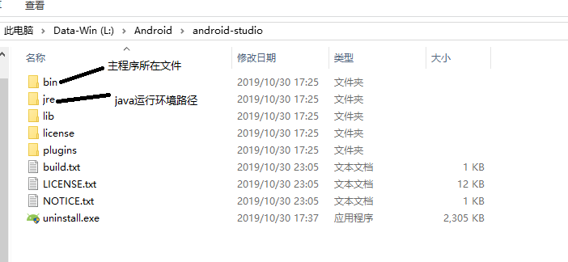
进入bin目录运行studio.exe即可启动Android Studio。第一次打开会有初始化向导，一般一路next就可完成，当然，如果网不好就只能科学上网了（实在被墙就只能尝试手动配置了，后面Android Studio配置的部分可以不看了）。

## 2.1 Android SDK
打开SDK Manager。
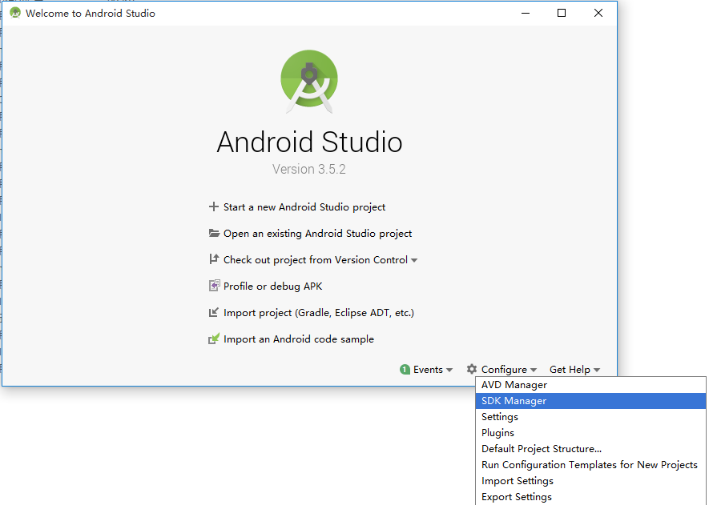
SDK Manager界面说明:
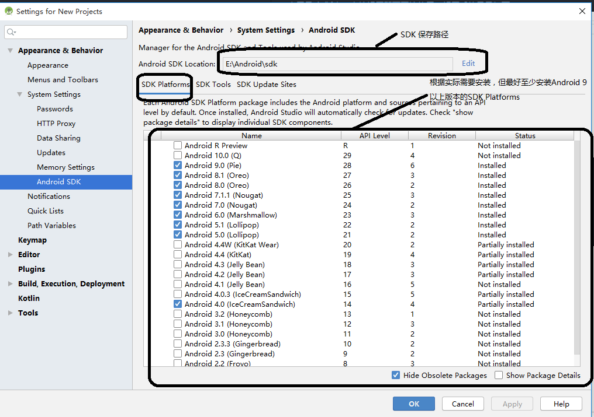
在SDK Tools选项卡中安装Android NDK：
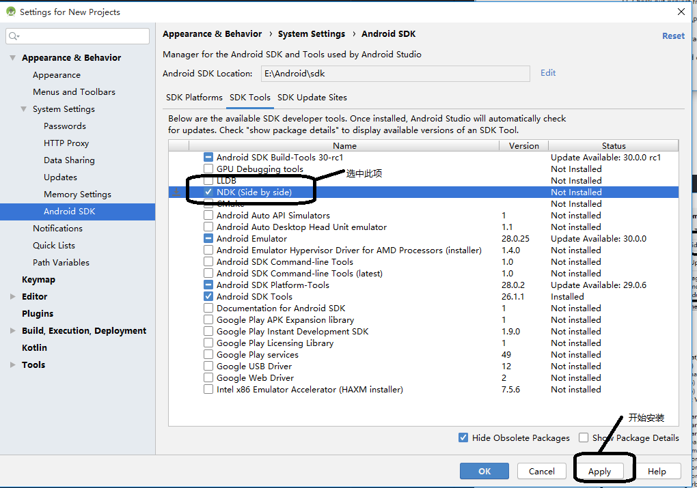

## 2.2 Android AVD配置

若有真实安卓机作为调试机器，则可以忽略这一步。

打开AVD Manager:
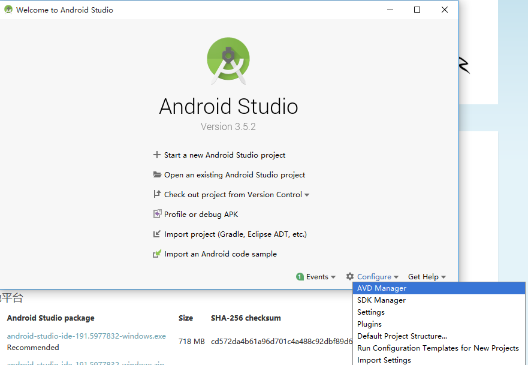
一般一路next即可:
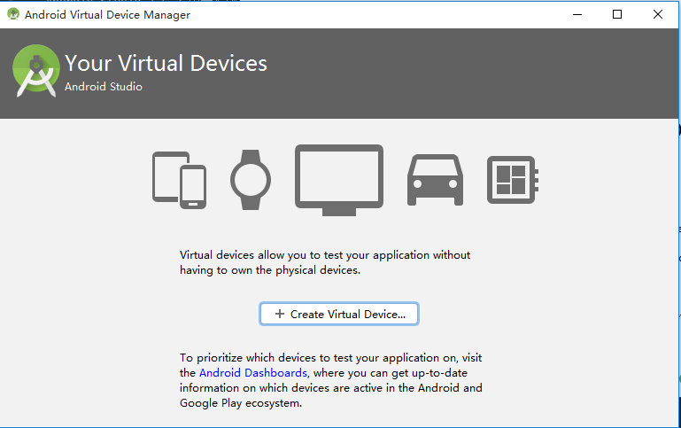
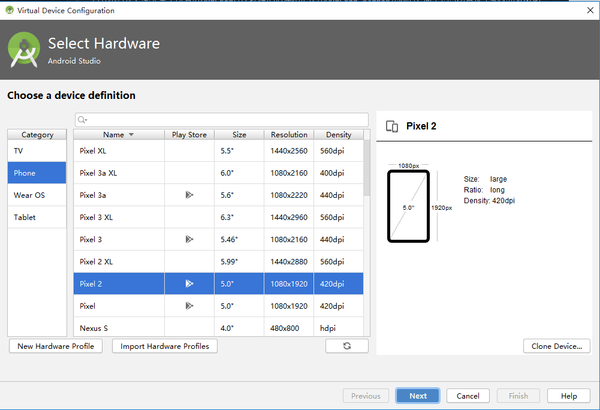
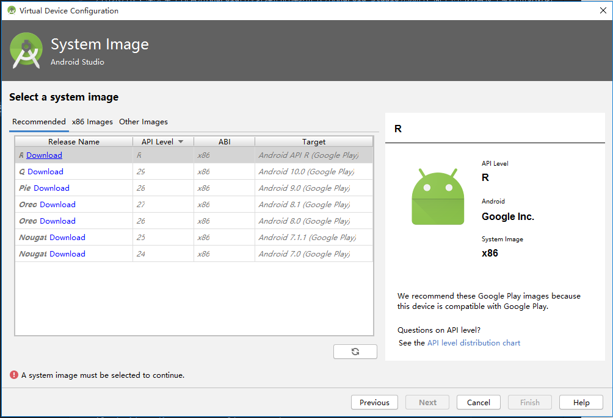

由于开始并没有在SDK中下载对应的虚拟机image，此时需要点击download下载。
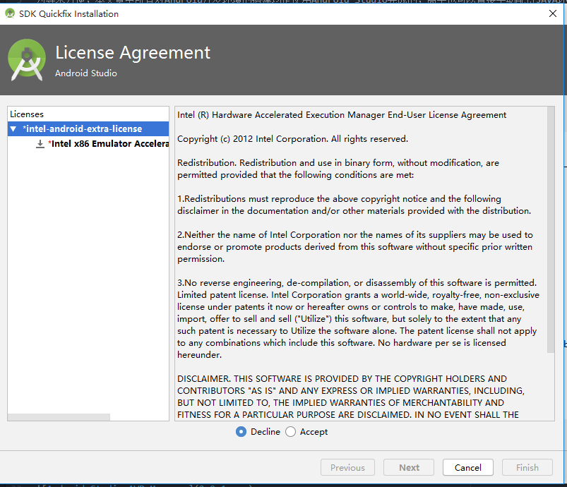
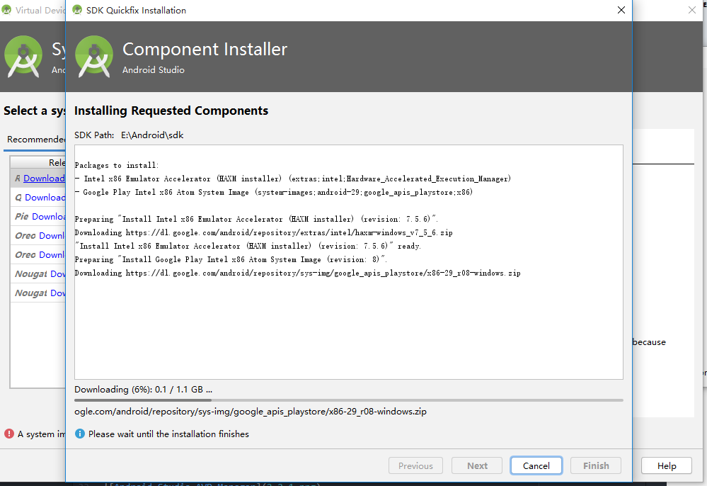

下载完成后，继续一路next即可：
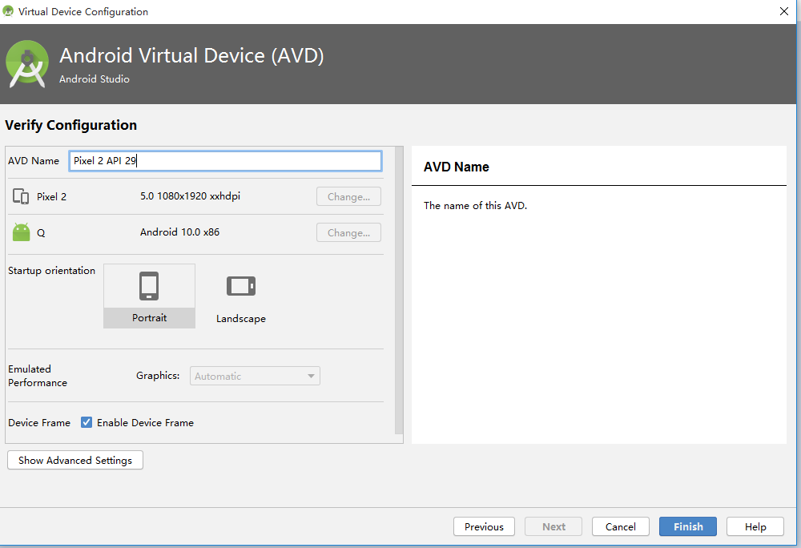

配置完成后，点击Acitionis的三角即可运行虚拟机（下次启动AVD Manager时可不必重新配置）。
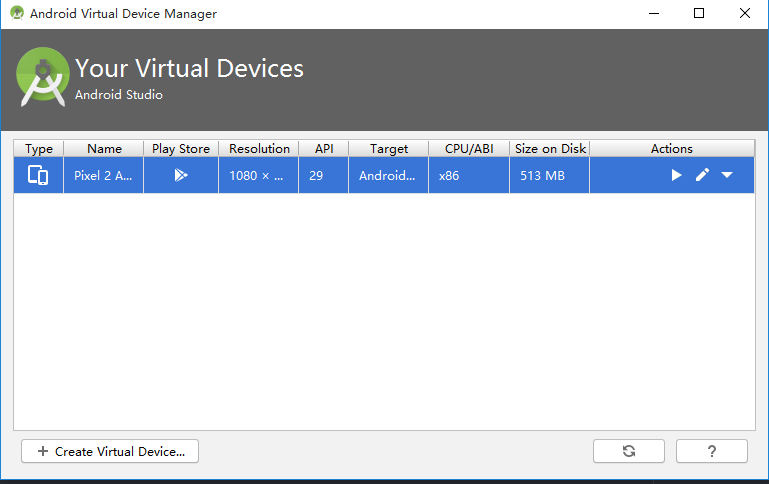
运行效果:
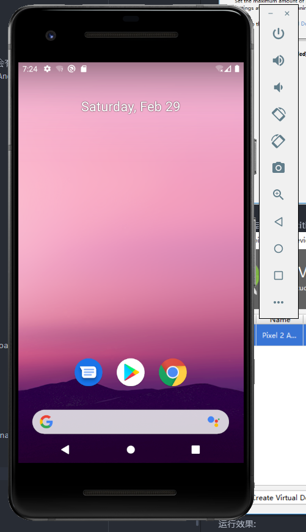

# 3.Qt5安装
安装一般一路next即可（可能需要注册Qt账号），需要注意的是，安装时需要选中与Android相关的组件。如果不确定要选那些组件而且空间也充足的话，可直接全选安装所有组件。

# 3.1 QtCreator设置

安装完成后，打开qtcreator，设置android相关路径，此时需要Android Studio安装时的相关路径。

到此，配置基本完成。

# 4.写在后面

QtCreator第一次进行编译Android程序时，需要一定的时间下载一些文件，建议最好先找个简单的示例工程编译。

上面的例子并没有编译成功，于是换了一个例子（设置是类似的）。
最后效果:

