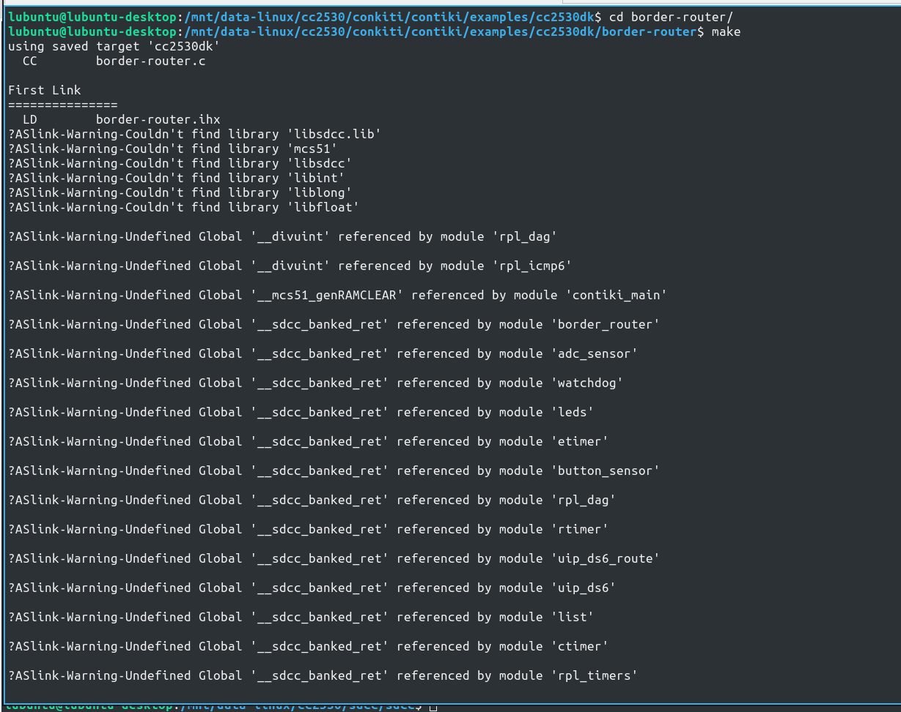
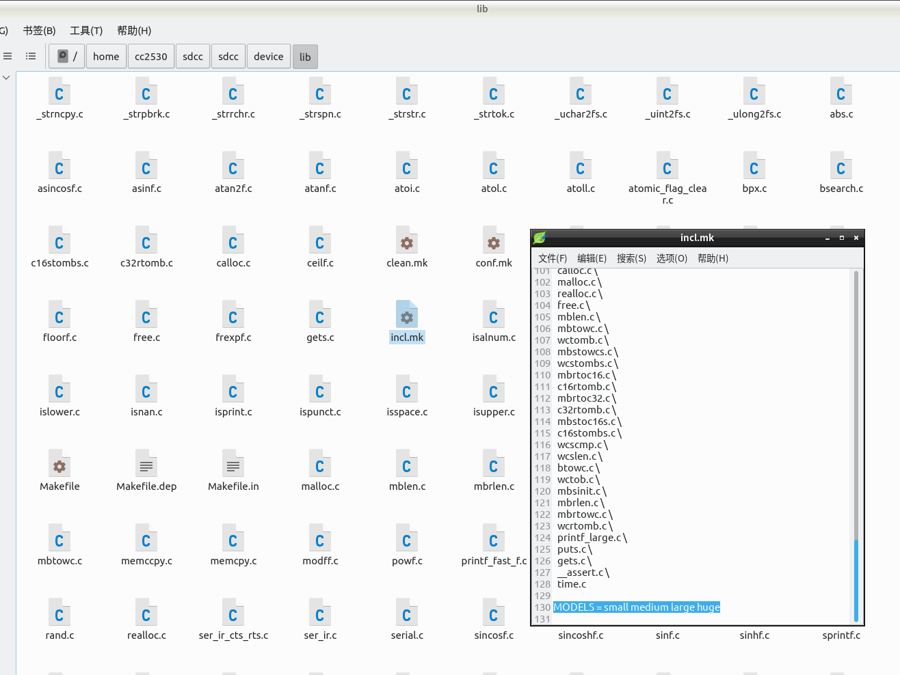
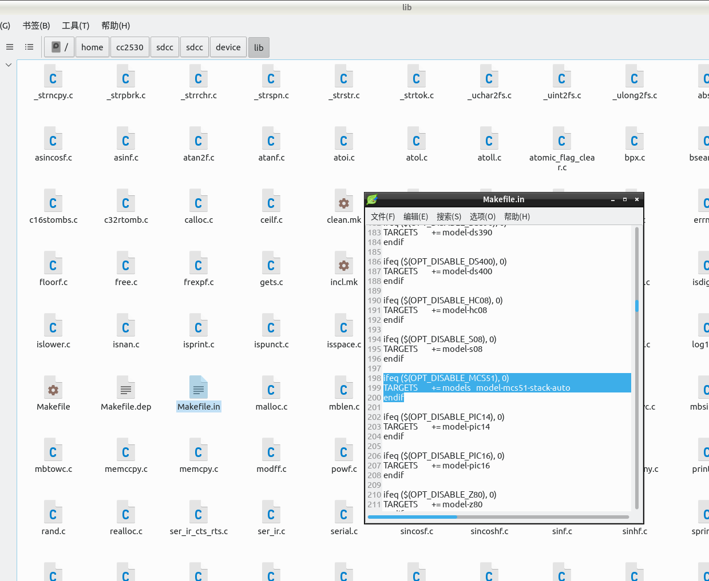

#  简介

使用[contiki](https://github.com/contiki-os/contiki.git)在CC2530上运行时，需要使用SDCC作为编译器。直接使用官方网站上或者linux发行版软件包的SDCC编译器，可能导致编译失败（程序需要超过64K时），而原因多半是官方编译器对其库文件的默认配置不支持huge-stack-auto,在链接时会报错,因而需要自己手动编译sdcc。

官方网站：http://sdcc.sourceforge.net/


错误如下：




# 编译

其在linux下的编译过程和其他使用configure编译的软件一样，主要分为以下步骤：

1. 下载源码
2. 解压源码
3. 在源码目录中执行./configure(如果报错就需要先安装报错中需要的软件)
4. make
5. make install（需要root权限）

源码的修改需要在第3步之前完成。

## 源码的修改


1.修改incl.mk(最新版可能无需修改)

  + 文件路径： SDCC源码目录/device/lib/incl.mk
  + 修改操作，确保MODELS =后包含huge，修改后如下
  + 

```c

      MODELS = small medium large huge
```
  2.修改 Makefile.in
   + 文件路径： SDCC源码目录/device/lib/Makefile.in
   + 修改操作，修改MCS51编译的TARGETS，修改后如下
   + 

```c

    ifeq ($(OPT_DISABLE_MCS51), 0)
		    TARGETS        += models   model-mcs51-stack-auto
    endif
```

