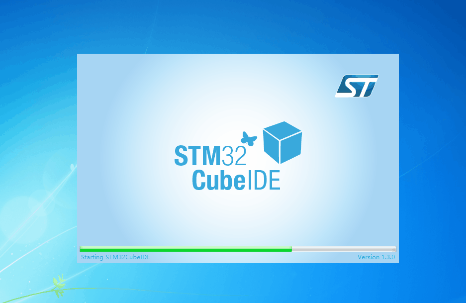
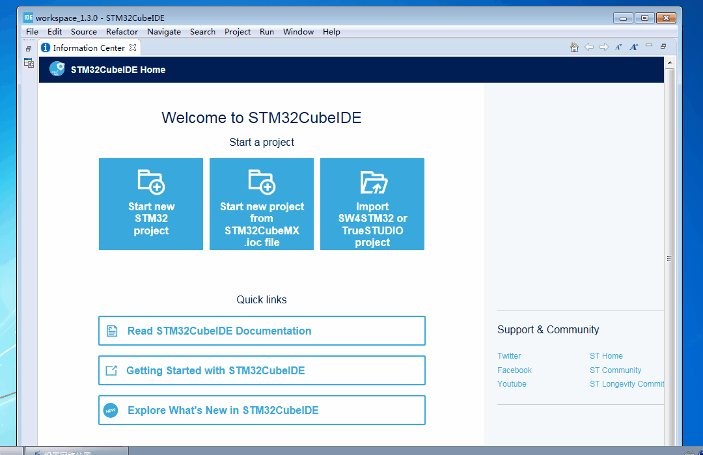

# STM32CubeIDE说明

stm32cubeide是一款基于eclipse CDT的集成开发环境，其采用GCC作为编译程序。而且其可以完美使用STM32CubeMX（内置）作为初始化代码生成工具，极大减轻了开发stm32的难度。其可以采用STLink和Jlink直接调试stm32单片机。

其中文下载地址:[STM32CubeIDE](https://www.st.com/zh/development-tools/stm32cubeide.html)

下载STM32CubeIDE需要注册ST的账号，下载完成后直接一路next即可，期间需要同意几次各种许可，由于stm32cubeide自带jdk运行环境，因此不需要单独安装jdk。

本文章提到的软件版本:STM32CubeIDE 1.3.0

## 安装对应的库以开发对应系列的单片机

运行完安装程序后，STM32CubeIDE的主要部分就安装完成了，接下来就需要安装STM32CubeMX所需要的库了。每次打开STM32CubeIDE后，后台会自动更新一些文件，此时不能进行库的安装，需要等待一段时间(2~3分钟)。

通过Help->Manage embedded software packages打开管理窗口，根据自己需要开发的单片机安装对应的库。如STM32F103C8T6，则只需要安装STM32F1和CMSIS的最新版即可。

##关于新建STM32工程

由于STM32CubeIDE是基于CDT的，因此，有很多相对多余的选项。新建工程时，需要选择名称中带有STM32的工程。

其选择界面与STM32CubeMX差不多。

