# **1.** 说明

在实际应用中，可能需要SSL/TLS加密通信,这时就需要使用到证书。而市面上的TLS/SSL证书大多数是要收费的(同时也会被大多数设备所信任，不用额外的操作)，而且一般不可能大量签发。当需要测试或者自用证书而又不想花费额外的费用，可以使用openssl自己制作证书。以下内容均不是绝对，仅为个人总结，也可以使用其它命令制作证书。

按照制作过程中使用的使用的命令和使用用途可分为可将证书分为CA证书和普通证书(服务端或者客户端)。CA证书用于签发普通证书并且需要安装在所有使用该证书签发的普通证书的设备上，CA证书的私钥由签发证书者持有。普通证书及其对应的私钥仅有该使用者持有。一般情况下，在单向认证（认证服务端）中,服务端需要持有CA证书、服务端证书和服务端证书对应的私钥,而客户端只需要持有CA证书即可,在双向认证(认证服务端和客户端)中,服务端和客户端均需要持有CA证书、本身的证书及其对应私钥,需要注意的是，若使用双向认证，每一个客户端均需要一个自己的证书。

# **2.** 证书制作

## **2.1.** CA证书制作

命令:

openssl req –new -x509  -days 36500 -extensions v3_ca -keyout ca.key -out ca.crt

部分选项说明:

| -days   | 有效时间长度，从签发时间开始计算 |
| ------- | -------------------------------- |
| -keyout | 输出私钥文件路径                 |
| -out    | 输出CA证书文件路径               |

说明:在命令执行过程中，要输入一些信息(给私钥加密的密码(此密码在签发普通证书时需要用到)、国别、省份（或州）、市、Common Name(在证书制作过程中，此参数表示IP地址或者域名)、邮件地址)等,这些信息可以任意填写，但Common Name最好不要与后面签发的证书相同,输入完成后，就可以得到CA证书和对应的私钥。

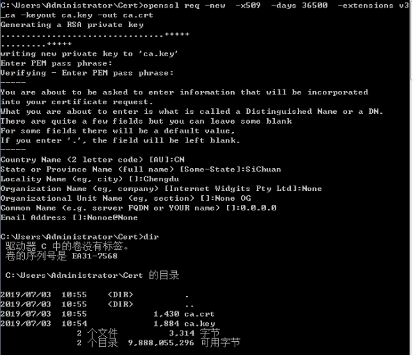 

上述命令执行完成后,就可以得到证书文件(ca.crt)和证书对应的私钥文件(ca.key)。

## **2.2.** 普通证书制作

普通证书制作时，需要填写的信息与CA证书差不多,不过需要注意的是,Common Name必须是使用将要生成的证书的主机的IP地址或者域名,否则使用证书过程中可能会报错(某些程序可以通过选项忽略此错误)。

普通证书的制作主要分为以下三步:

l 生成私钥(可以是加密的或者不加密)。

l 生成证书签发请求。

l 用CA证书及秘钥签发证书。

### **2.2.1.** 生成私钥

生成的私钥可以是加密的或者不加密的,如果需要加密私钥(每次使用时均需要输入密码)只要添加-des3即可。

命令:

| 生成加密私钥   | openssl genrsa -out server.key 2048                          |
| -------------- | ------------------------------------------------------------ |
| 生成不加密私钥 | openssl genrsa ***\*–\*******\*des3\**** -out server.key 2048 |

一般情况下,私钥不用加密。命令中-out是指定输出的私钥文件路径,某位的数字表示私钥的长度(单位为bit)。

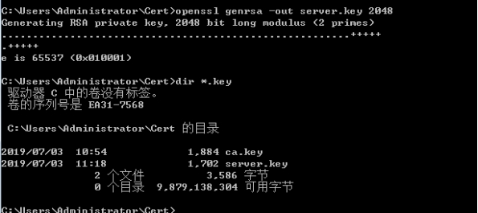 

命令执行完成后,就可以得到私钥文件server.key

### **2.2.2.** 生成证书签发请求

生成证书签发请求需要用到刚才生成的私钥,命令执行过程中需要输入一系列信息(国别、省份（或州）、市、Common Name(在证书制作过程中，此参数表示IP地址或者域名)、邮件地址),最后需要输入一些给CA的信息（由于是自己签发证书,因此可以不用输入）。

命令:

openssl req -out server.csr -key server.key -new

命令中-out是指定输出的证书签发请求文件路径，-key是指定使用的私钥文件路径。

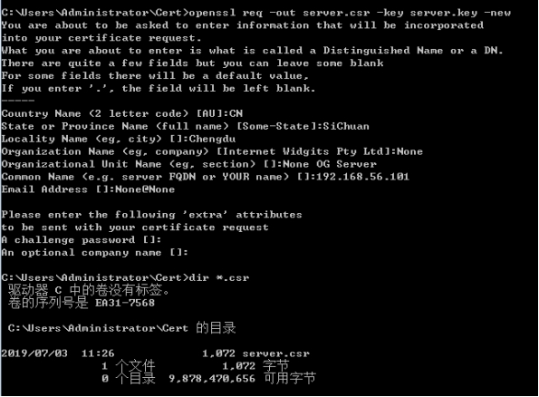 

命令成功执行后,便可以得到证书签发请求文件server.csr。

### **2.2.3.** 签发证书

得到证书签发请求后,就可以使用CA证书及对应的秘钥签发证书了。

命令:

openssl x509 -req -in server.csr -CA ca.crt -CAkey ca.key -CAcreateserial -out server.crt -days 36500

参数说明:

| -in    | 输入的证书签发请求文件路径       |
| ------ | -------------------------------- |
| -CA    | 输入的CA证书文件路径             |
| -CAkey | 输入的CA证书私钥路径             |
| -out   | 输出的证书路径                   |
| -days  | 有效时间长度，从签发时间开始计算 |

签发过程中，程序会显示签发请求中的信息（即制作签发请求文件过程中输入的信息）需要使用CA证书私钥的密码。

签发完成后,就可以得到证书文件server.crt。

 

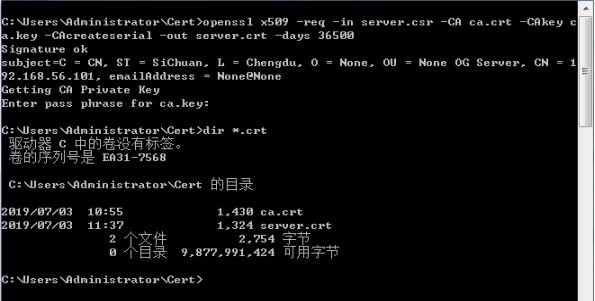 

# **3.** 部分证书格式转换

在实际使用过程中,可能受应用环境的限制，需要确定的证书格式的证书,此时，就需要进行证书格式的转换。

## **3.1.** PEM格式证书

命令:

openssl x509 -in server.crt -outform pem -out server.pem

参数说明:

| -in      | 输入的证书文件路径，可能需要使用-inform指定格式。 |
| -------- | ------------------------------------------------- |
| -outform | 输出的证书文件格式。                              |
| -out     | 输出的证书文件路径。                              |

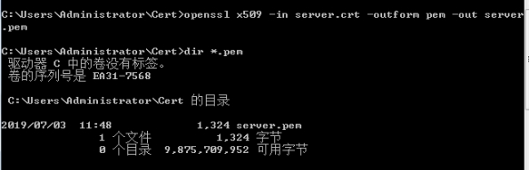 

命令成功执行后,便可以得到server.pem证书文件。

## **3.2.** DER格式证书

命令:

openssl x509 -in server.crt -outform der -out server.der

参数说明:

| -in      | 输入的证书文件路径，可能需要使用-inform指定格式。 |
| -------- | ------------------------------------------------- |
| -outform | 输出的证书文件格式。                              |
| -out     | 输出的证书文件路径。                              |

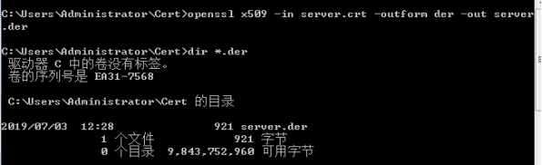 

命令执行成功后,便可以得到server.der证书。

# **4.** 结果

## **4.1.** CA证书

自己的根证书在默认情况下是不会被windows系统所承认的,只有将证书安装至系统的受信任的根证书颁发机构,windows系统才会认可此根证书及使用其签发的其它证书(不会显示红色的叉)。

安装根证书可以使用双击证书文件再属性中打开安装向导一步一步安装,也可以使用windows自带的证书管理器(certmgr.msc)安装,还可以使用windows SDK中的certmgr.exe安装。

 

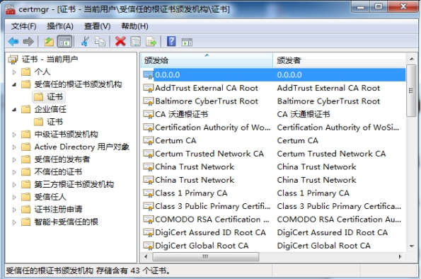 

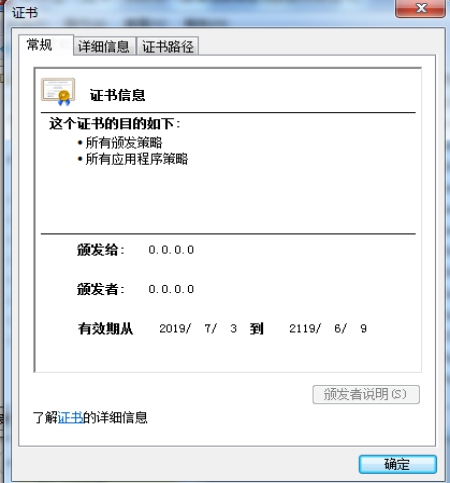 

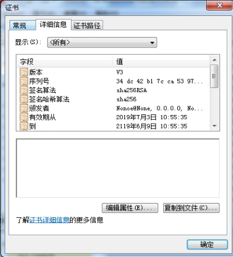 

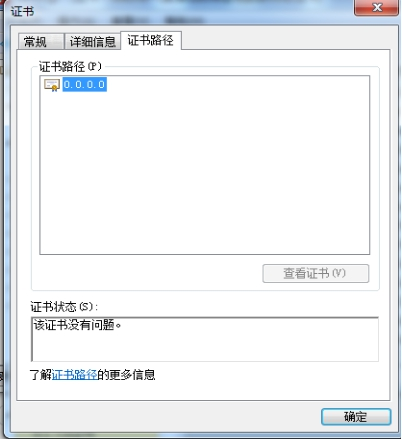 

## **4.2.** 签发的证书

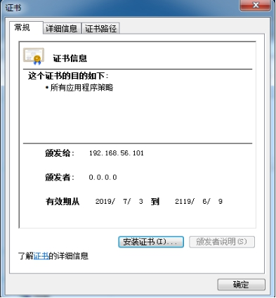 

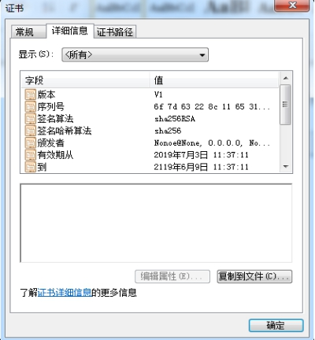 

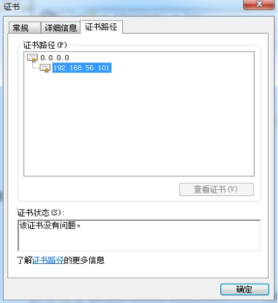 

 

 

 

 