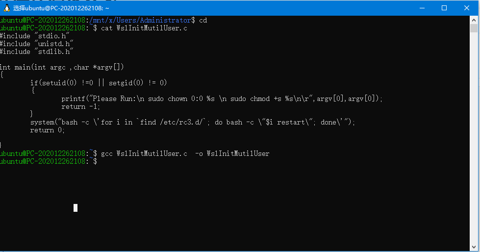
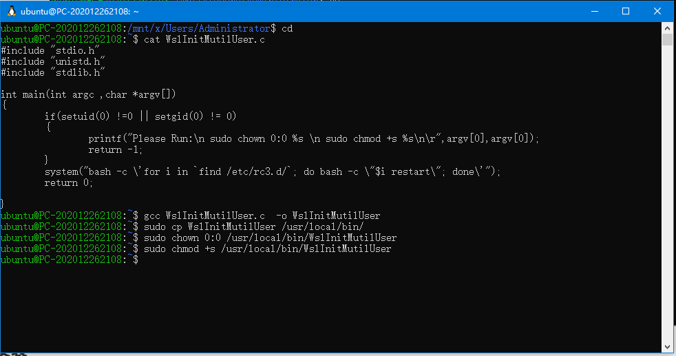
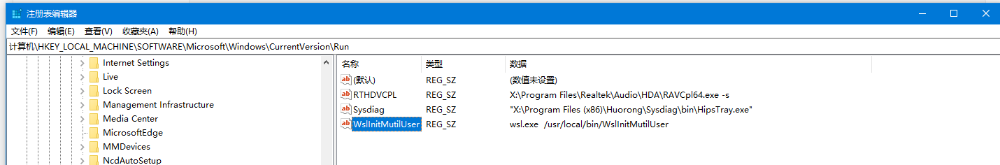
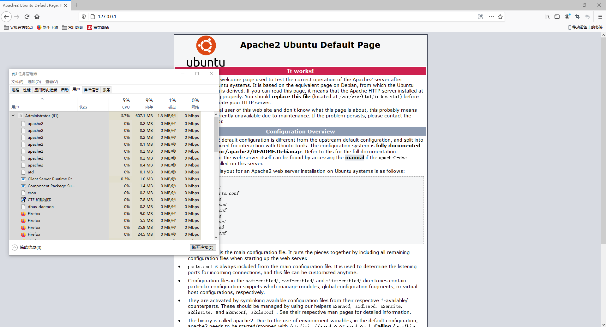

# 说明

Windows的WSL子系统极大的方便了Linux软件在windows下的开发。但其有一个极大的缺陷，即几乎没有Init操作，不会启动后台守护进程（至少到文章编写时）。而有时编写软件时又需要用到一些后台进程，如Rsyslog,虽然可以通过手动执行/etc/init.d下的脚本来启动守护进程，但仍然不方便。

## 操作系统版本

### Microsoft Windows [版本 10.0.19042.685]

## WSL

### ubuntu focal 20.04

## 具体思路

通过注册表 计算机\HKEY_LOCAL_MACHINE\SOFTWARE\Microsoft\Windows\CurrentVersion\Run 运行一个WSL下的程序，再有该程序完成以下操作:

1. 提权。（提升到Root权限）
2. 依次执行/etc/rc3.d/下的文件

注意:此程序在下称为WslInitMutilUser。

# 程序代码及安装

## 编译环境

需要安装build-essential软件包

## 代码

```c++
#include "stdio.h"
#include "unistd.h"
#include "stdlib.h"

int main(int argc ,char *argv[])
{
        if(setuid(0) !=0 || setgid(0) != 0)
        {
                printf("Please Run:\n sudo chown 0:0 %s \n sudo chmod +s %s\n\r",argv[0],argv[0]);
                return -1;
        }
        system("bash -c \'for i in `find /etc/rc3.d/`; do bash -c \"$i restart\"; done\'");
        return 0;

}
```

## 编译安装

注意:所有sudo安装操作可能需要输入密码。

### 编译

```
 gcc WslInitMutilUser.c  -o WslInitMutilUser
```



### 安装WSL程序

将程序文件复制到/usr/local/bin/,并赋予setuid权限。

```
sudo cp WslInitMutilUser /usr/local/bin/
sudo chown 0:0 /usr/local/bin/WslInitMutilUser
sudo chmod +s /usr/local/bin/WslInitMutilUser
```



## 测试WSL程序

在windows下的cmd.exe执行观察是否能正常工作（主要是测试能否正常启动WslInitMuilUser）。

```
wsl WslInitMutilUser
```


## 写入注册表自启

名字自定义，内容如下:

```
wsl.exe   /usr/local/bin/WslInitMutilUser
```



# 最终效果

开机登陆后会自动启动后台守护进程(一个黑框一闪而逝)。后台进程均自动启动。可在WSL下使用update-rc.d命令管理守护进程的自启。




# 注意事项

有的后台进程(如openssh-server)可能由于WSL本身的初始根文件系统问题不能自启，卸载相关软件包再重新安装即可。