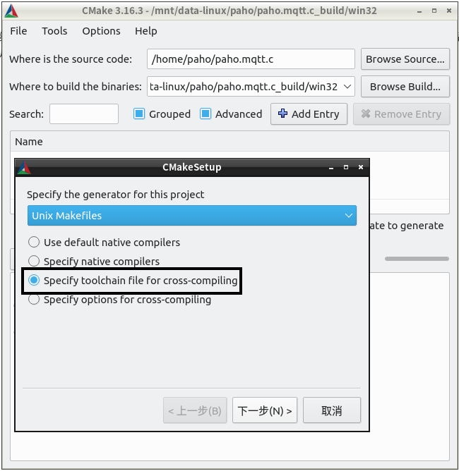
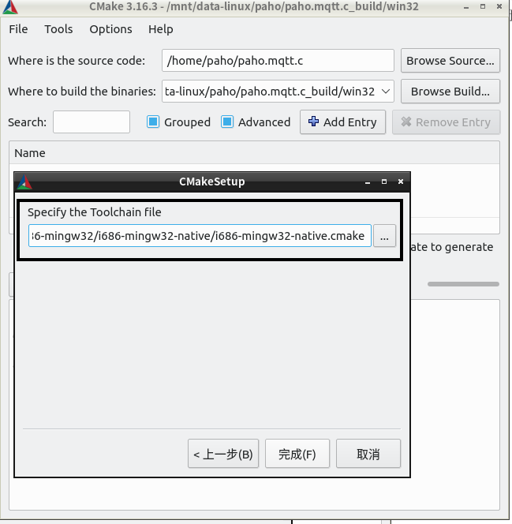
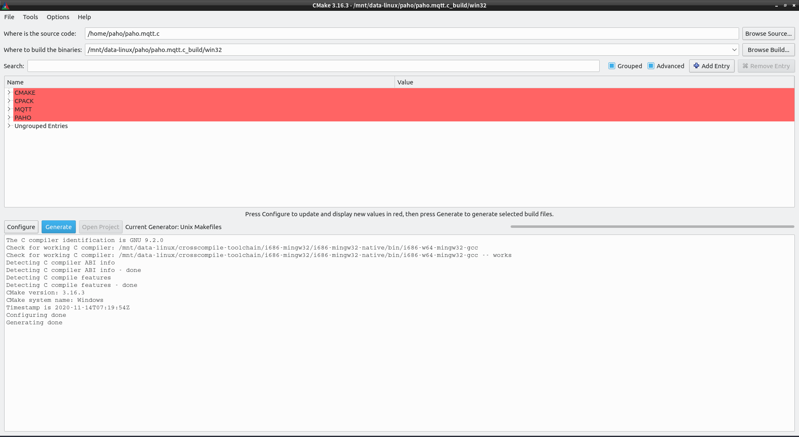
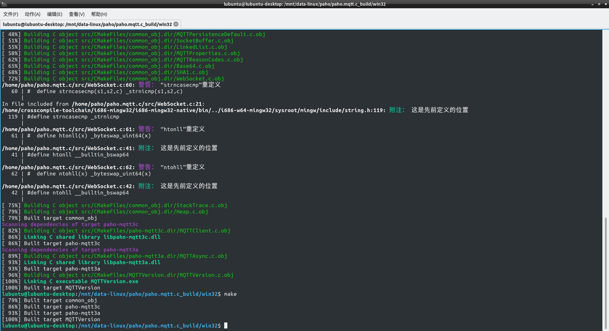

# 说明

很多C/C++项目是通过[CMAKE](https://cmake.org/)管理其源代码的．当需要交叉编译时，可以通过cmake-gui一个一个配置交叉编译所需要的定义（系统类型/C编译器/C++编译器）．但更加方便的是,事先准备好一个设定交叉编译的配置文件(以.cmake结尾),交叉编译时直接选中该文件,也方便切换不同的交叉工具链．下面的说明均是基于使用mingw gcc在linux下编译windows程序.


- 在cmake-gui中选择使用配置文件.



- 选择代表不同工具链的配置文件.



- 配置完成,可使用make编译



- 使用make编译




# 配置文件说明

配置文件并不是某个程序自动生成的,而是需要手动编写的.配置文件的写法与CMakeList.txt差不多,但需要需注意的是,配置文件中只需要设定编译工具链相关信息,不包含任何工程信息.

在配置文件中至少需要设定以下变量:

- CMAKE_SYSTEM_NAME
- CMAKE_C_COMPILER
- CMAKE_CXX_COMPILER
- CMAKE_ADDR2LINE 
- CMAKE_AR 
- CMAKE_RANLIB 
- CMAKE_CXX_COMPILER_AR 
- CMAKE_CXX_COMPILER_RANLIB
- CMAKE_C_COMPILER_AR
- CMAKE_C_COMPILER_RANLIB 
- CMAKE_Fortran_COMPILER 
- CMAKE_OBJCOPY 
- CMAKE_OBJDUMP
- CMAKE_RC_COMPILER 
- CMAKE_READELF 
- CMAKE_STRIP
- CMAKE_LINKER 

## i686-w64-mingw32工具链配置文件示例

```c
set(CMAKE_SYSTEM_NAME Windows)
set(CMAKE_C_COMPILER /mnt/data-linux/crosscompile-toolchain/i686-mingw32/i686-mingw32-pthread/bin/i686-w64-mingw32-gcc)
set(CMAKE_CXX_COMPILER /mnt/data-linux/crosscompile-toolchain/i686-mingw32/i686-mingw32-pthread/bin/i686-w64-mingw32-g++)
set(CMAKE_ADDR2LINE /mnt/data-linux/crosscompile-toolchain/i686-mingw32/i686-mingw32-pthread/bin/i686-w64-mingw32-addr2line)
set(CMAKE_AR /mnt/data-linux/crosscompile-toolchain/i686-mingw32/i686-mingw32-pthread/bin/i686-w64-mingw32-ar)
set(CMAKE_RANLIB /mnt/data-linux/crosscompile-toolchain/i686-mingw32/i686-mingw32-pthread/bin/i686-w64-mingw32-ranlib)
set(CMAKE_CXX_COMPILER_AR /mnt/data-linux/crosscompile-toolchain/i686-mingw32/i686-mingw32-pthread/bin/i686-w64-mingw32-ar)
set(CMAKE_CXX_COMPILER_RANLIB /mnt/data-linux/crosscompile-toolchain/i686-mingw32/i686-mingw32-pthread/bin/i686-w64-mingw32-ranlib)
set(CMAKE_C_COMPILER_AR /mnt/data-linux/crosscompile-toolchain/i686-mingw32/i686-mingw32-pthread/bin/i686-w64-mingw32-ar)
set(CMAKE_C_COMPILER_RANLIB /mnt/data-linux/crosscompile-toolchain/i686-mingw32/i686-mingw32-pthread/bin/i686-w64-mingw32-ranlib)
set(CMAKE_Fortran_COMPILER /mnt/data-linux/crosscompile-toolchain/i686-mingw32/i686-mingw32-pthread/bin/i686-w64-mingw32-gfortan)
set(CMAKE_OBJCOPY /mnt/data-linux/crosscompile-toolchain/i686-mingw32/i686-mingw32-pthread/bin/i686-w64-mingw32-objcopy)
set(CMAKE_OBJDUMP /mnt/data-linux/crosscompile-toolchain/i686-mingw32/i686-mingw32-pthread/bin/i686-w64-mingw32-objdump)
set(CMAKE_RC_COMPILER /mnt/data-linux/crosscompile-toolchain/i686-mingw32/i686-mingw32-pthread/bin/i686-w64-mingw32-windres)
set(CMAKE_READELF /mnt/data-linux/crosscompile-toolchain/i686-mingw32/i686-mingw32-pthread/bin/i686-w64-mingw32-readelf)
set(CMAKE_STRIP /mnt/data-linux/crosscompile-toolchain/i686-mingw32/i686-mingw32-pthread/bin/i686-w64-mingw32-strip)
set(CMAKE_LINKER /mnt/data-linux/crosscompile-toolchain/i686-mingw32/i686-mingw32-pthread/bin/i686-w64-mingw32-ld)
```

此编译工具链的二进制执行文件目录为/mnt/data-linux/crosscompile-toolchain/i686-mingw32/i686-mingw32-pthread/bin/,实际使用时需要修改为自己编译工具链的二进制执行文件路径.

## x86_64-w64-mingw32工具链配置文件示例

```
set(CMAKE_SYSTEM_NAME Windows)
set(CMAKE_C_COMPILER /mnt/data-linux/crosscompile-toolchain/x86_64-mingw32-w64/x86_64-mingw32-w64-native/bin/x86_64-w64-mingw32-gcc)
set(CMAKE_CXX_COMPILER /mnt/data-linux/crosscompile-toolchain/x86_64-mingw32-w64/x86_64-mingw32-w64-native/bin/x86_64-w64-mingw32-g++)
set(CMAKE_ADDR2LINE /mnt/data-linux/crosscompile-toolchain/x86_64-mingw32-w64/x86_64-mingw32-w64-native/bin/x86_64-w64-mingw32-addr2line)
set(CMAKE_AR /mnt/data-linux/crosscompile-toolchain/x86_64-mingw32-w64/x86_64-mingw32-w64-native/bin/x86_64-w64-mingw32-ar)
set(CMAKE_RANLIB /mnt/data-linux/crosscompile-toolchain/x86_64-mingw32-w64/x86_64-mingw32-w64-native/bin/x86_64-w64-mingw32-ranlib)
set(CMAKE_CXX_COMPILER_AR /mnt/data-linux/crosscompile-toolchain/x86_64-mingw32-w64/x86_64-mingw32-w64-native/bin/x86_64-w64-mingw32-ar)
set(CMAKE_CXX_COMPILER_RANLIB /mnt/data-linux/crosscompile-toolchain/x86_64-mingw32-w64/x86_64-mingw32-w64-native/bin/x86_64-w64-mingw32-ranlib)
set(CMAKE_C_COMPILER_AR /mnt/data-linux/crosscompile-toolchain/x86_64-mingw32-w64/x86_64-mingw32-w64-native/bin/x86_64-w64-mingw32-ar)
set(CMAKE_C_COMPILER_RANLIB /mnt/data-linux/crosscompile-toolchain/x86_64-mingw32-w64/x86_64-mingw32-w64-native/bin/x86_64-w64-mingw32-ranlib)
set(CMAKE_Fortran_COMPILER /mnt/data-linux/crosscompile-toolchain/x86_64-mingw32-w64/x86_64-mingw32-w64-native/bin/x86_64-w64-mingw32-gfortan)
set(CMAKE_OBJCOPY /mnt/data-linux/crosscompile-toolchain/x86_64-mingw32-w64/x86_64-mingw32-w64-native/bin/x86_64-w64-mingw32-objcopy)
set(CMAKE_OBJDUMP /mnt/data-linux/crosscompile-toolchain/x86_64-mingw32-w64/x86_64-mingw32-w64-native/bin/x86_64-w64-mingw32-objdump)
set(CMAKE_RC_COMPILER /mnt/data-linux/crosscompile-toolchain/x86_64-mingw32-w64/x86_64-mingw32-w64-native/bin/x86_64-w64-mingw32-windres)
set(CMAKE_READELF /mnt/data-linux/crosscompile-toolchain/x86_64-mingw32-w64/x86_64-mingw32-w64-native/bin/x86_64-w64-mingw32-readelf)
set(CMAKE_STRIP /mnt/data-linux/crosscompile-toolchain/x86_64-mingw32-w64/x86_64-mingw32-w64-native/bin/x86_64-w64-mingw32-strip)
set(CMAKE_LINKER /mnt/data-linux/crosscompile-toolchain/x86_64-mingw32-w64/x86_64-mingw32-w64-native/bin/x86_64-w64-mingw32-ld)
```


此编译工具链的二进制执行文件目录为/mnt/data-linux/crosscompile-toolchain/x86_64-mingw32-w64/x86_64-mingw32-w64-native/bin/,实际使用时需要修改为自己编译工具链的二进制执行文件路径.