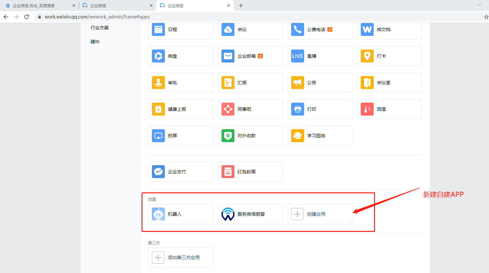
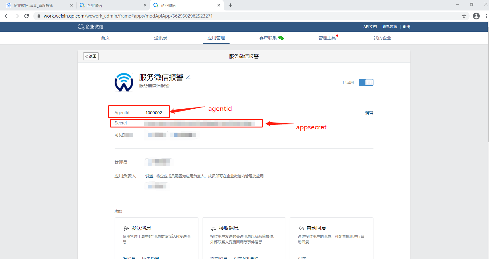
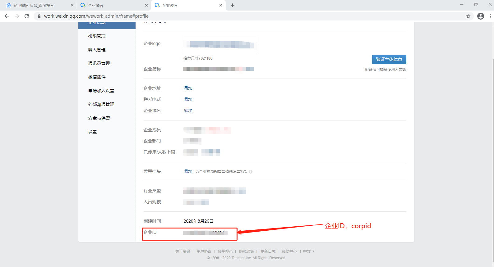
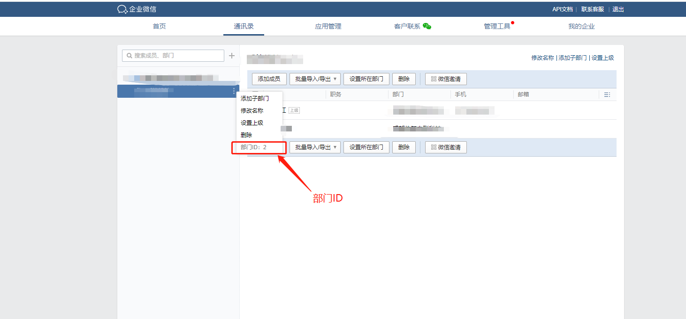
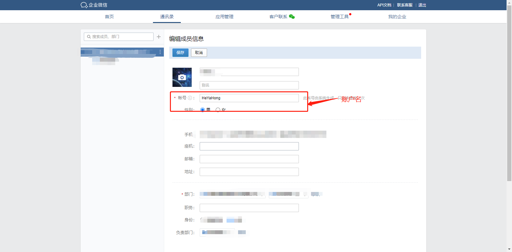
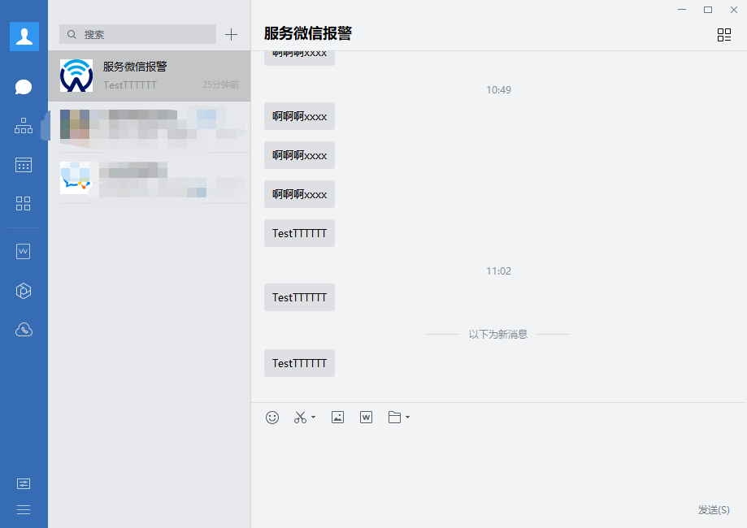

# 说明

使用企业微信（申请账号以及新建公司等步骤已省略）的自建APP的API可实现脚本发送消息。要想使用自建APP，必须先新建自建APP。

新建完成后，可获得自建APP的appsecret和agentid。

还需要企业ID作为获取access_token的参数。

## 发送的对象

### 部门

部门可使用部门ID作为发送对象。

### 人员

人员可使用账户名作为发送对象。

# 注意事项

- 发送的对象必须处于自建APP的可见范围之内。
- 由于采用了第三方服务，实际可能会随着时间的变化而失效，当前日期2020-12-01

# 效果截图

